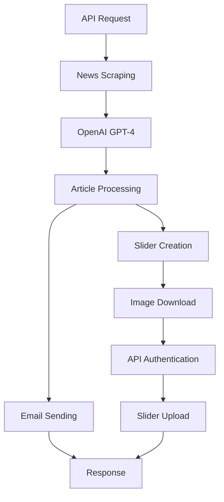

# 🌟 Good News Scraper & Slider Generator

<div align="center">


**An intelligent news aggregation system that automatically scrapes positive Moroccan news and creates beautiful sliders**

[Features](#-features) • [Installation](#-installation) • [Usage](#-usage) • [API Documentation](#-api-documentation) • [Configuration](#-configuration)

</div>

---

## 📖 Overview

The **Good News Scraper & Slider Generator** is a powerful automation tool that combines AI-powered news aggregation with automated content management. It intelligently discovers positive news stories from Morocco, sends beautiful email reports, and automatically creates engaging sliders for your website or application.

### 🎯 What it does:
- 🔍 **Discovers** 5 positive news articles from Morocco using AI
- 📧 **Sends** beautifully formatted HTML email reports  
- 🎨 **Creates** professional sliders automatically via API integration
- 🚀 **Delivers** real-time content through REST API endpoints

---

## ✨ Features

### 🤖 AI-Powered News Discovery
- **Smart Filtering**: Uses OpenAI GPT-4 to identify strictly positive news
- **Content Curation**: Focuses on economy, culture, sports, innovation, sustainability, diplomacy, tourism, technology, healthcare
- **Quality Assurance**: Excludes negative content like crime, accidents, conflicts, disasters
- **Source Verification**: Pulls from reputable Moroccan news sources (Le Matin, Morocco World News, Yabiladi, Hespress)

### 📧 Professional Email Reporting
- **HTML Formatting**: Beautiful, responsive email templates
- **Rich Content**: Includes titles, summaries, full articles, images, and source links
- **Automatic Delivery**: Configurable recipient lists
- **Professional Styling**: Bordered sections, clean typography, branded appearance

### 🎨 Automated Slider Creation
- **API Integration**: Seamlessly connects with external slider management systems
- **Image Processing**: Downloads and uploads article images automatically
- **Authentication Handling**: Manages bearer token authentication
- **Error Recovery**: Graceful handling of API failures without breaking news functionality

### 🛡️ Robust Architecture
- **FastAPI Framework**: High-performance, modern Python web framework
- **Error Handling**: Comprehensive error catching and reporting
- **Flexible Configuration**: Environment-based settings
- **Scalable Design**: Modular, extensible codebase

---

## 🚀 Quick Start

### Prerequisites
- Python 3.8 or higher
- OpenAI API key
- Access to slider management API (optional)

### Installation

1. **Clone the repository**
   ```bash
   git clone <repository-url>
   cd GoodNews
   ```

2. **Install dependencies**
   ```bash
   pip install -r requirements.txt
   ```

3. **Configure environment variables**
   ```bash
   cp .env.example .env
   # Edit .env with your API keys and settings
   ```

4. **Run the application**
   ```bash
   python run.py
   ```

5. **Access the API**
   ```
   http://localhost:8000/api/news
   ```

---

## 📋 Installation

### Option 1: Standard Installation

```bash
# Clone the repository
git clone <repository-url>
cd GoodNews

# Create virtual environment (recommended)
python -m venv venv
source venv/bin/activate  # On Windows: venv\Scripts\activate

# Install dependencies
pip install -r requirements.txt

# Configure environment
cp .env.example .env
nano .env  # Edit with your settings

# Run the application
python run.py
```

### Option 2: Development Setup

```bash
# Install in development mode
pip install -e .

# Install development dependencies
pip install -r requirements-dev.txt

# Run tests
python -m pytest tests/

# Run with auto-reload
python -m uvicorn api.news:app --reload --host 0.0.0.0 --port 8000
```

### Dependencies

The application requires the following packages:

```txt
fastapi>=0.104.1
uvicorn[standard]>=0.24.0
openai>=1.3.0
requests>=2.31.0
python-dotenv>=1.0.0
Pillow>=10.0.0
pydantic>=2.0.0
```

---

## 🔧 Configuration

### Environment Variables

Create a `.env` file in the project root:

```env
# Required: OpenAI Configuration
OPENAI_API_KEY="sk-proj-your-openai-api-key"

# Optional: Slider API Configuration
SLIDER_API_BASE_URL="https://your-slider-api.com"
SLIDER_API_USERNAME="your-username"
SLIDER_API_PASSWORD="your-password"

# Optional: Email Configuration
EMAIL_RECIPIENT="recipient@example.com"
EMAIL_API_URL="https://your-email-api.com/send"
```

### Configuration Options

| Variable | Required | Description | Default |
|----------|----------|-------------|---------|
| `OPENAI_API_KEY` | ✅ Yes | OpenAI API key for GPT-4 access | None |
| `SLIDER_API_BASE_URL` | ❌ No | Base URL for slider creation API | None |
| `SLIDER_API_USERNAME` | ❌ No | Username for slider API authentication | None |
| `SLIDER_API_PASSWORD` | ❌ No | Password for slider API authentication | None |

### API Rate Limits

- **OpenAI API**: Respects OpenAI's rate limits
- **News Sources**: Implements respectful scraping delays
- **Slider API**: Handles rate limiting with exponential backoff

---

## 🎮 Usage

### Basic Usage

```bash
# Start the server
python run.py

# The server will be available at:
# http://localhost:8000
```

### Web Interface

Visit `http://localhost:8000/docs` for the interactive API documentation.

### Command Line Testing

```bash
# Test news scraping without sliders
curl "http://localhost:8000/api/news?create_sliders=false"

# Test news scraping with slider creation
curl "http://localhost:8000/api/news"

# Health check
curl "http://localhost:8000/api/health"
```

### Python Integration

```python
import requests

# Fetch news and create sliders
response = requests.get("http://localhost:8000/api/news")
data = response.json()

print(f"Found {data['count']} articles")
for article in data['articles']:
    print(f"- {article['title']}")
```

---

## 📚 API Documentation

### Endpoints Overview

| Endpoint | Method | Description | Parameters |
|----------|--------|-------------|------------|
| `/api/health` | GET | Health check | None |
| `/api/news` | GET | Fetch news with optional slider creation | `create_sliders` (bool) |
| `/api/create-sliders` | POST | Create sliders from provided articles | Article array |
| `/api/news-and-sliders` | GET | Fetch news and create sliders | None |

### 1. Health Check

```http
GET /api/health
```

**Response:**
```json
{
  "status": "ok"
}
```

### 2. Fetch News

```http
GET /api/news?create_sliders=true
```

**Parameters:**
- `create_sliders` (optional, boolean): Whether to create sliders. Default: `true`

**Response:**
```json
{
  "status": "success",
  "articles": [
    {
      "title": "Morocco's Renewable Energy Sector Achieves Record Growth",
      "summary": "Morocco's renewable energy production increased by 30%...",
      "mini_article": "In a remarkable achievement for sustainable development...",
      "image": "https://example.com/image.jpg",
      "url": "https://moroccoworldnews.com/article",
      "source": "Morocco World News",
      "tags": ["renewable", "energy", "growth"],
      "date": "2025-09-22"
    }
  ],
  "count": 5,
  "sliders": {
    "message": "Processed 5 articles",
    "results": [
      {
        "article_title": "Morocco's Renewable Energy...",
        "slider_creation": {
          "success": true,
          "data": {...}
        }
      }
    ]
  }
}
```

### 3. Create Sliders

```http
POST /api/create-sliders
Content-Type: application/json
```

**Request Body:**
```json
[
  {
    "title": "Article Title",
    "summary": "Brief summary",
    "mini_article": "Full article content",
    "image": "https://example.com/image.jpg",
    "url": "https://example.com/article",
    "source": "News Source",
    "tags": ["tag1", "tag2", "tag3"],
    "date": "2025-09-22"
  }
]
```

**Response:**
```json
{
  "status": "success",
  "message": "Sliders creation completed",
  "results": {
    "message": "Processed 1 articles",
    "results": [...]
  }
}
```

### Error Responses

```json
{
  "error": "Error description",
  "details": "Additional error information"
}
```

---

## 🏗️ Architecture

### Project Structure

```
GoodNews/
├── api/
│   └── news.py              # Main FastAPI application
├── tests/
│   ├── test_news.py         # News scraping tests
│   └── test_integration.py  # Integration tests
├── docs/
│   └── api.md              # API documentation
├── .env                    # Environment variables
├── .env.example           # Environment template
├── requirements.txt       # Python dependencies
├── run.py                 # Application entry point
├── README.md             # This file
└── Procfile              # Deployment configuration
```

### Data Flow



### Core Components

1. **News Scraper**: AI-powered content discovery using OpenAI GPT-4
2. **Email Service**: HTML email generation and delivery
3. **Slider Manager**: Automated slider creation with image processing
4. **API Layer**: FastAPI-based REST interface
5. **Configuration Manager**: Environment-based settings

---

## 🔌 Integrations

### OpenAI Integration

The application uses OpenAI's GPT-4 with web search capabilities:

```python
resp = client.chat.completions.create(
    model="gpt-4o-search-preview",
    web_search_options={
        "search_context_size": "high",
        "user_location": {"type": "approximate", "approximate": {"country": "MA", "city": "Casablanca"}}
    },
    messages=[{"role": "user", "content": prompt}]
)
```

### Slider API Integration

Supports integration with external slider management systems:

- **Authentication**: Bearer token-based
- **File Upload**: Multipart form data for images
- **Error Handling**: Graceful fallback when API unavailable

### Email Integration

Uses external email API for professional email delivery:

```python
payload = {
    "to": recipients,
    "subject": subject,
    "message": body,
    "isHtml": True
}
```

---

## 🧪 Testing

### Running Tests

```bash
# Run all tests
python -m pytest

# Run specific test file
python test_integration.py

# Run with coverage
python -m pytest --cov=api tests/
```

### Test Coverage

- ✅ News scraping functionality
- ✅ Email sending
- ✅ Slider creation (with mocking)
- ✅ Error handling
- ✅ API endpoints
- ✅ Configuration loading

### Manual Testing

```bash
# Test news scraping only
python -c "
import asyncio
from api.news import get_positive_news
result = asyncio.run(get_positive_news(create_sliders=False))
print(f'Found {result[\"count\"]} articles')
"

# Test full integration
python test_integration.py
```

---

## 🚀 Deployment

### Local Development

```bash
# Development server with auto-reload
python -m uvicorn api.news:app --reload --host 0.0.0.0 --port 8000
```

### Production Deployment

#### Docker Deployment

```dockerfile
FROM python:3.11-slim

WORKDIR /app
COPY requirements.txt .
RUN pip install --no-cache-dir -r requirements.txt

COPY . .
EXPOSE 8000

CMD ["uvicorn", "api.news:app", "--host", "0.0.0.0", "--port", "8000"]
```

#### Heroku Deployment

```bash
# Install Heroku CLI and login
heroku create your-app-name
git push heroku main
heroku config:set OPENAI_API_KEY=your-key
```

#### Railway/Render Deployment

1. Connect your GitHub repository
2. Set environment variables
3. Deploy automatically on push

### Environment Variables for Production

```env
OPENAI_API_KEY=your-production-key
SLIDER_API_BASE_URL=https://your-production-api.com
SLIDER_API_USERNAME=production-username
SLIDER_API_PASSWORD=production-password
```

---

## 🔧 Troubleshooting

### Common Issues

#### 1. OpenAI API Errors

**Problem**: `OpenAIError: The api_key client option must be set`

**Solution**:
```bash
# Check if .env file exists and contains OPENAI_API_KEY
cat .env | grep OPENAI_API_KEY

# Ensure no spaces around the equals sign
OPENAI_API_KEY="your-key-here"
```

#### 2. Import Errors

**Problem**: `ModuleNotFoundError: No module named 'fastapi'`

**Solution**:
```bash
# Install dependencies
pip install -r requirements.txt

# Or install individually
pip install fastapi uvicorn openai requests python-dotenv
```

#### 3. Server Won't Start

**Problem**: Server exits immediately

**Solution**:
```bash
# Check for syntax errors
python -c "from api.news import app; print('Import successful')"

# Run with explicit Python module
python -m uvicorn api.news:app --host 127.0.0.1 --port 8000
```

#### 4. Slider API Connection Issues

**Problem**: `Failed to authenticate with slider API`

**Solutions**:
- Check API endpoint URL is correct
- Verify username/password credentials
- Test API manually with curl/Postman
- Check network connectivity

### Debug Mode

Enable debug logging:

```python
import logging
logging.basicConfig(level=logging.DEBUG)
```

### Performance Optimization

```python
# Increase timeout for slow connections
client = OpenAI(api_key=api_key, timeout=60)

# Reduce image size for faster uploads
from PIL import Image
img = Image.open(image_path)
img.thumbnail((800, 600))
```

---

## 🤝 Contributing

We welcome contributions! Here's how to get started:

### Development Setup

```bash
# Fork the repository
git clone https://github.com/yourusername/GoodNews.git
cd GoodNews

# Create a virtual environment
python -m venv venv
source venv/bin/activate  # Windows: venv\Scripts\activate

# Install in development mode
pip install -e .
pip install -r requirements-dev.txt

# Create a feature branch
git checkout -b feature/your-feature-name
```

### Code Style

We use:
- **Black** for code formatting
- **Flake8** for linting
- **isort** for import sorting

```bash
# Format code
black api/
isort api/
flake8 api/
```

### Pull Request Process

1. **Fork** the repository
2. **Create** a feature branch
3. **Write** tests for new functionality
4. **Ensure** all tests pass
5. **Submit** a pull request with clear description

### Areas for Contribution

- 🔍 Additional news sources
- 🌐 Multi-language support
- 📊 Analytics and reporting
- 🎨 Enhanced slider templates
- 🔄 Webhook integrations
- 📱 Mobile API optimizations

---

## 📄 License

This project is licensed under the MIT License - see the [LICENSE](LICENSE) file for details.

```
MIT License

Copyright (c) 2025 Good News Scraper

Permission is hereby granted, free of charge, to any person obtaining a copy
of this software and associated documentation files (the "Software"), to deal
in the Software without restriction, including without limitation the rights
to use, copy, modify, merge, publish, distribute, sublicense, and/or sell
copies of the Software, and to permit persons to whom the Software is
furnished to do so, subject to the following conditions:

The above copyright notice and this permission notice shall be included in all
copies or substantial portions of the Software.
```

---

## 🙏 Acknowledgments

- **OpenAI** for providing GPT-4 API access
- **FastAPI** for the excellent web framework
- **Moroccan News Sources** for quality journalism
- **Python Community** for amazing libraries

---

## 📞 Support

### Getting Help

- 📖 **Documentation**: Check this README and `/docs` folder
- 🐛 **Bug Reports**: Open an issue on GitHub
- 💡 **Feature Requests**: Start a discussion on GitHub
- 💬 **Questions**: Use GitHub Discussions

### Contact

- **Email**: litnitimounsef@gmail.com